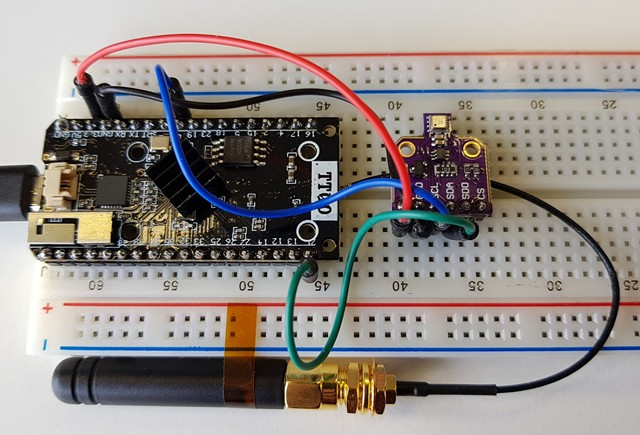

# Arduino-ESP32 and BME680 on The Things Network Example using TTGO LoRa32 V1 (ESP32+SX1276) board

## Usage

 1. Create a `ttn_secrets.h` containing your TTN secrets.

``` C
#include <Arduino.h>
#include <lmic.h>

static const u1_t PROGMEM APPEUI[8] = { 0x00, 0x00, 0x00, 0x00, 0x00, 0x00, 0x00, 0x00 };
static const u1_t PROGMEM DEVEUI[8] = { 0x01, 0x00, 0x00, 0x00, 0x00, 0x00, 0x00, 0x00 };
static const u1_t PROGMEM APPKEY[16] = { 0x2B, 0x7E, 0x15, 0x16, 0x28, 0xAE, 0xD2, 0xA6, 0xAB, 0xF7, 0x15, 0x88, 0x09, 0xCF, 0x4F, 0x3C };
```
2. Set the correct pins in `main.ino`.

``` C
const lmic_pinmap lmic_pins = {
    .nss = 18,
    .rxtx = LMIC_UNUSED_PIN,
    .rst = 14,
    .dio = {26, 33, 32},
};
```
``` C
SPI.begin(5, 19, 27, 18);
``` 

`main.ino` is based on the following example https://github.com/matthijskooijman/arduino-lmic/blob/master/examples/ttn-otaa/ttn-otaa.ino

## Copy & Pasted together using
- https://www.thethingsnetwork.org/
- https://platformio.org/
- https://github.com/espressif/arduino-esp32
- https://github.com/matthijskooijman/arduino-lmic
- https://github.com/sabas1080/CayenneLPP
- https://github.com/adafruit/Adafruit_BME680

## Hardware
- TTGO LoRa32 V1 (ESP32+SX1276)
- BME680


